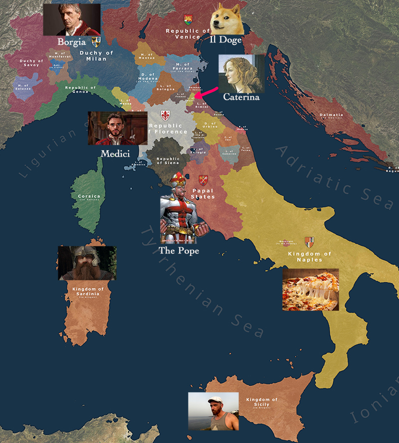
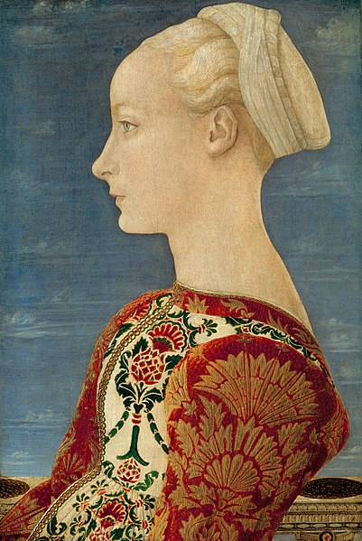
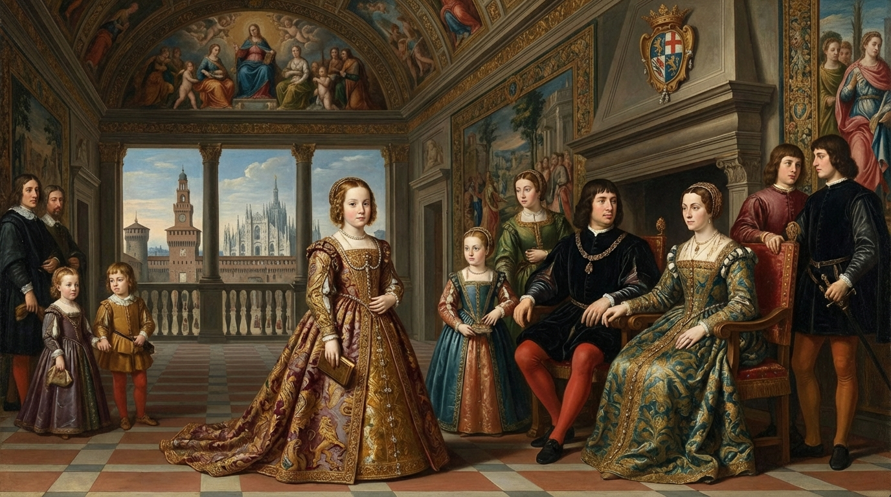
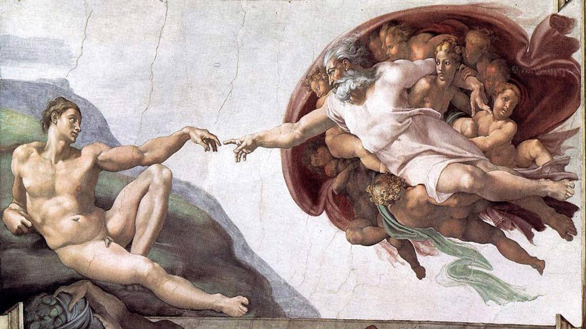
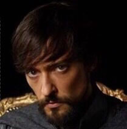
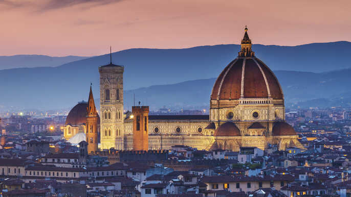
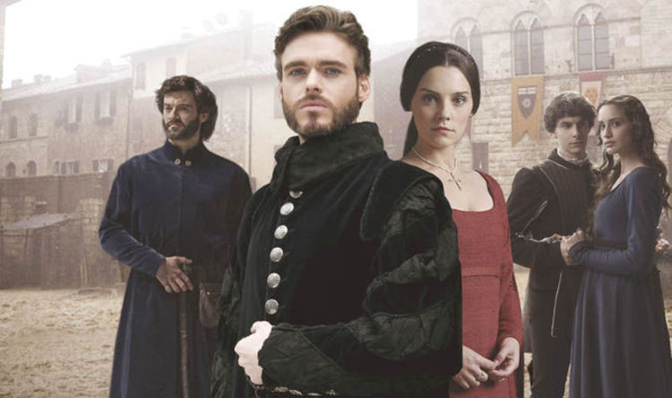
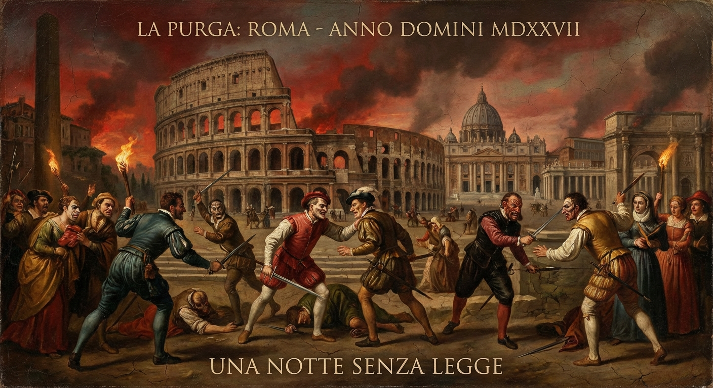
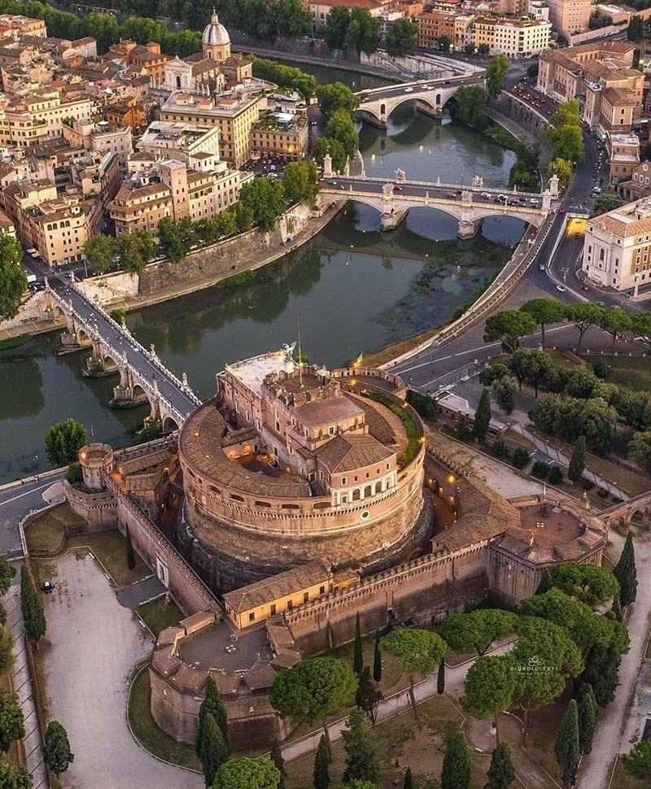

Do you ever miss **Game of Thrones**, with its political intrigue, meals that end in tragedy, and recreational incest? Well, stop inflicting the latest seasons on yourself, and read about the **Italian Renaissance** instead!

You get the same kind of stories involving **murder** and **sex** that you like so much, but significantly fewer dragons ex machina.

## The world map

Set between the 14th and 15th century, **Renaissance Italy** was divided into states led by powerful houses, like the Aragon in Naples, the Pope in Rome, the Medici in Florence, the Borgia in Milan, and stench of rotten fish in Venice.

<FigureLabel>
    Click to zoom. Original map found <a href="https://i.redd.it/pmxtfnf176f51.jpg">here</a>.
</FigureLabel>

The period was choke-full with incredible characters, like *Lorenzo de Medici* - also called The Magnificent, mostly by himself - the polymath *Leonardo da Vinci*, the scheming *Niccolò Machiavelli*, the Shakespearean *Lucrezia Borgia*.

With time, we'll get to talk about all of them. Now, I'd like to focus on my favorite by far, **Caterina Sforza**.

## Early life

Caterina was the illegitimate daughter of **Galeazzo Maria Sforza** and gargantuanly hot mistress **Lucrezia Landriani**.

<FigureLabel>
    Lucrezia Landriani. Milf.
</FigureLabel>

Being from **Milan**, Caterina's bastard last name should have been **Fog**, if not for the fact that Galeazzo took her as his own daughter, raising her as a proper Sforza.

The **Sforza family** had humble beginnings as warriors for hire and were then promoted to nobility thanks to their achievements on the battlefield. The forefather of House Sforza was [Muzio Attendolo](https://en.wikipedia.org/wiki/Muzio_Attendolo_Sforza), a character so cool that he deserves his own entry.

Caterina was both silent and cunning when circumstances allowed for it, and absolute badass when push came to shove.

Galeazzo let her pursue her interests even if not necessarily ladylike, such as alchemy, fencing, and hunting. On a more negative note, he married her off to a much older **husband** when she was only 13. This was recognized as fundamentally cringe even at the time and had to be done on the *hush-hush*.

The husband was **Girolamo Riario**. He wasn't particularly strong, smart, attractive, or deserving in any way, shape or form, but his uncle was the Motherfucking Pope **Sisto IV**, so he had that going for him.

<FigureLabel>
    Fun fact: the <strong>Sistine Chapel</strong> is named after Pope Sisto IV, who commissioned it. Well, he didn't actually pay it himself. Jesus did.
</FigureLabel>

Uncle Sisto gifted the lordship of **Forlì** to the newlyweds. 

The couple didn't immediately settle in, as they were spending their days in Rome, with Caterina making herself known by the aristocracy, and Girolamo plotting against **Lorenzo the Magnificent**, because the Pope totally hated the guy and thought that he wasn't so magnificent after all.

<FigureLabel>
    Girolamo in some tv series with Girolamo in it.
</FigureLabel>

## Red wedding, italian style

The Pope assigned his nephew a simple sub-quest.

<Dialogue>Girolamo, would you kindly <strong>murder</strong> the brothers Lorenzo and Giuliano de Medici for me, if it's not too much of a bother?</Dialogue>

Girolamo came up with a convoluted plot that involved the help of the **Pazzi** family in Florence, who also weren't crazy about the Medici. You see, this is funny because Pazzi means *crazy*.

It's worth keeping in mind that Girolamo was a fool, unreliable when it came to *anything*.

His idea was to **poison** the two brothers during a banquet. But poisoning two people isn't exactly simple. They both need to eat the tainted food at the same moment, otherwise one will notice something's off and you'll only succeed in killing one of them.

The plan was then changed into an assault during mass at **Santa Maria del Fiore**, with a trusted hire going all stabby-stabby on the Medici siblings.

<FigureLabel>
    The low key cathedral where the murders were supposed to take place.
</FigureLabel>

However, **Montesecco**, the guy designated to carry out order 66, balked at the idea:

<Dialogue>I can't commit murder inside a church. Are you for real? I have principles!</Dialogue>

So, two unvetted killers were found last minute, as if this was a movie from the **Coen Brothers**.

The pair of nihilists waited for everybody in the church to get on their knees, as was customary at the time, and unleashed their high dps attacks. But instead of splitting the targets, both morons charged on **Giuliano**, who didn't stand a chance. This gave Lorenzo the opportunity to spider-man away.

Needless to say, Lorenzo wasn't too thrilled about the ordeal, which will be known to posterity as **The Pazzi Conspiracy**. He promised a thorough investigation.

Despite not taking part in the murder, **Montesecco** was arrested because, when anything fishy happened in Florence, you could rest assured that Montesecco had a role in it. Everybody knew it.

Lorenzo had him tortured until he shouted: "𝗦𝗛𝗜𝗥𝗘! 𝗕𝗔𝗚𝗚𝗜𝗡𝗦!"

This is how it was discovered that Caterina's husband was the - air quotes - mastermind behind it all.

<FigureLabel>
    Instead of their portraits, I'm using a photo from the tv show Medici: Masters of Florence because, to be honest, the Medici siblings weren't exactly good looking.
</FigureLabel>

Of course, Girolamo didn't love being found out, but he wasn't too concerned either.

<Dialogue>As long as my uncle, TᕼE ᗰOTᕼEᖇᖴᑌᑕKIᑎG ᑭOᑭE, is alive, I'm safe.</Dialogue>

Then, the Pope died.

## The taking of Castel Sant'Angelo

The death of **Sisto IV** posed a problem for Girolamo Riario because, you see, he had this natural talent of making everybody despise him, so there were a great many people waiting for the right moment to get rid of him in a definitive fashion. Probably Lorenzo de' Medici wasn't even the angriest at the guy!

Little known fact, but when a Pope dies, Rome becomes the set of a **Purge** movie. Thefts, revenge killings, orgies, cats and dogs living together. Maybe they figure it's the only time when **God** is not watching.

You could say that there was a certain pressure on the clergy to poop out a new Pope asap.

Given the chaos, the moment was ripe for Girolamo to be **brutally murdered** several consecutive times. With her husband panicking under a sofa, Caterina realized she had to step up and get in the game.

<Dialogue>Well, I guess I'm going to have to fix your shit.</Dialogue>

She must have said. She was 21 years old and seven months **pregnant**.

Caterina rode her horse to **Castel Sant'Angelo**, the bastion that overlooked the city, and convinced the guards to let her in.

<Dialogue>Oh, you wouldn't leave a pregnant woman out in the cold, would you? 🥺</Dialogue>

Once inside, she occupied the fortress, which gave her access to heavy and wisely positioned cannons.

<FigureLabel>
    Castel Sant'Angelo looks like it can contain some serious loot, but also an annoying boss.
</FigureLabel>

Her message was clear:

<Dialogue>We need safe passage out of Rome. Until this is granted, if you dare cross the bridge to go elect a new Pope, I'm going to <strong>blow your asses</strong> up to the moon. And let me remind you that we know so little about the moon, but it does seem inhospitable!</Dialogue>

There was some nervous back and forth outside the castle. The **cardinals** were begging Caterina to let go, and Caterina from the walls was giving off *immaculate* nope vibes.

Finally, it was agreed that she and her husband would not only receive safe passage, but they would also retain the lordship of **Forlì**. Caterina doubled down:

<Dialogue>Ok cool, but I also want money, soldi, dinero, pengarna.</Dialogue>

The cardinals couldn't take an L this big. They approached her husband. Girolamo agreed that what Caterina was asking was **wrong**. But what can you do? Bitches be crazy.

<ResponsiveEmbed src="https://giphy.com/embed/OjXdclxJmH9VzpcaYm" ratio="1:1" />

Finally, the cardinals blinked and added a payment for 8000 ducats to the contract. Caterina accepted and left the castle. As the Riarios reached Forlì, they learned that a Pope had been elected: **Innocent VIII**.

The new Pope was a generous and kind man, which was rather novel for a Pope. All in all, he only hated one person, and that person was **Girolamo Riario**, to the surprise of no one.

**End of Part 1.**

Now, quick, go to [Part 2](/caterina-sforza-2) of Caterina's story. Will she and her husband enjoy their reign in Forlì and be happy ever after?

<Spoiler>
    Nope.
</Spoiler>
