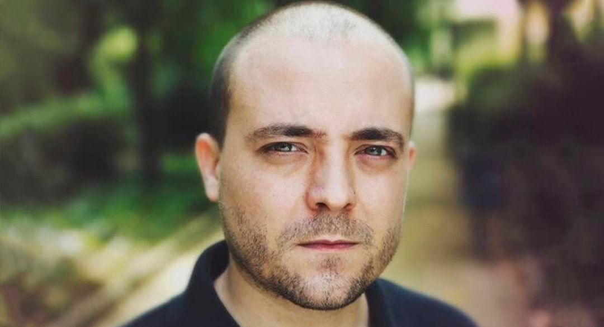

<TextBox title="Disclaimer" closeable={true}>
    The following is the real account of something that happened to me in the Summer of 2020.

    As with all accurate stories, what you are about to read is ballpark 64% true.

    I'm sorry, but I don't feel that I owe you radical honesty. It's not like this is my blog or anything. I will happily deviate from the Truth if this leads to a more compelling story, helps me make a point, or it creates an opportunity for comedy.

    And you know what, you do the same.

    You rewrite past experiences so that you come across as the hero, the victim, or both. You hold grudges based on skewed interpretations. You take me hostage with your retelling of events and then get mad at me when I ask your ex for his version of the story.

    At least I am sincere about my insincerity.

    
</TextBox>

So, I was thinking.

It seems like enough water has flowed under the bridge, we are several booster shots past the pandemic, and it's maybe time to ask...

<Pony>Are we tired of all those jokes about how terrible 2020 was?</Pony>

...

This is not rhetorical. Rhetorical questions are a waste of time. Please answer, so we can move on.

<Poll id="wink"
      question="Are we tired of all those jokes about how terrible 2020 was?"
      answers={["Oh my god, yes!", "Nope, keep 'em coming"]}
      labels={["Tired", "Not tired"]}
/>

Exactl-- wait, we are?! 😳

Ok, I did not expect that. I thought that 2020 jokes were going to be fine for at least a decade!

But *no problemo*, I’ll improvise something. We don't need to talk about no pandemics. Let me think...

So... what’s the deal with the post office, am I right? They ask you to lick the stamps, and I’m like, for real? In all these centuries have we developed no better technology than the spit on our tongue? And worst of all, am I supposed to use my saliva in public during a pandem— FUCK!

Fine, let's discuss the plague one last time and use this as an opportunity to heal, like literally.

First of all, I have to say that 2020 was not the worst year for me. Not by a long shot. That would be 2019.

In early 2019, my grandmother died and— you know, it’s ok, she was 94.

<TextBox title={"By the way"}>
    Something that I like to do when people tell me that their grandparent died is to react in a shocked and sorrowful way. This triggers in them a quintessentially human response. They will minimize their loss to make me feel better.

    <Dialogue>Oh, well, she's lived a long life.</Dialogue>

    And I'm counting on this, because I can reply:

    <Dialogue>Did she? Then I guess good riddance! Why did you even tell me? I'm happy the bitch is gone. I hope she died in pain!</Dialogue>

    Which is very funny to me!

    Now that I'm older, I know that I can't do this anymore. I simply cannot troll friends that are mourning their grandparents. I'm gonna have to do it with their parents.

    
</TextBox>

Anyway, in hindsight, and considering what was about to unfold, dying in 2019? Excellent choice, Anna!

Then, a few months later I was assaulted.

Let me paint the scene. Exterior/Night. I’m walking home from a party and someone punches me in the head from behind. I don't see the assailant, so I'm guessing a gang of 16 sumo wrestlers whose grandparents recently passed.

As a result, I lose consciousness and smash my face on the ground, breaking my nose, cutting my face, and looking super clumsy in the process.

<FigureLabel>Fun fact, this is not my original face. It comes from a donor. Yeah, I know, it's not like you can pick and choose.</FigureLabel>

And the worst part is that the attack was completely unprovoked. Although when it occurred I was listening to the Joe Rogan podcast, so I’m not saying that I’m blameless.

What else happened in 2019? Ah yeah, my laptop got stolen. It happened at nighttime, after I was punched by strangers from behind and— oh, there’s your motive right there! 🙈

<ResponsiveEmbed ratio={"16:7"} src={"https://i.makeagif.com/media/2-14-2016/vslHU-.gif"}/>

<FigureLabel>A few weeks later, I asked the police about the investigation, hoping to recreate this scene from <i>The Big Lebowski</i>. Instead, they sweetly told me they'd arrested some kids for similar attacks in the nearby park, so I could rest assured. How could they not recreate that scene for me? Pigs.</FigureLabel>

Last but not least, in that very same year I broke up with my long-time partner. Or rather you should say that she broke up with me if you are a glass half empty kind of person.

So, you can agree that 2019 was for me a continuous series of punches, some of them literal, and by that I don't mean that my ex beat me. I'm still talking about the assault.

Still, I’ve tried my best to keep an upward facing chin. I recall that at the end of 2019, on New Year's Eve, I patted myself on the back saying hang in there, buddy! 2020 is going to be your year.

And don’t get me wrong, it was!

## Grief

One thing that I like to do every time I break up with someone is to go through a grief phase.

Since break ups make me conclude that I’m a worthless piece of pickled garbage, I take the chance to behave like one. I think it really helps!

<ResponsiveEmbed ratio={"4:3"} src={"https://baldereschi.it/sr/thedude3.gif"}/>

In this period I completely isolate myself from the outside world, spending entire stretches of time indoors, always wearing sweatpants, always working from home.

And the rare times I venture outside for groceries, since I don’t want people to have their day ruined by looking at my face, I cover it with a mask.

So that was 2020 in a nutshell for me, and I have to say I was relieved to see that I was not the only one going through such a phase!

## Escape

Then, one day I decided that my apartment got too dirty, and I was ready to move on to a new apartment.

I was also like what the hell, let’s take some time off to allow workers inside with napalm, so I went on a vacation to Sicily, where my family is from.

That’s where I met her.

Let me paint the scene. Exterior/Day. I’m driving a Vespa like a *cliché* when I notice a woman working at the gas station, her skin blessed by the sun, long dark curly hair, almond brown eyes.

She is wearing work overalls like Super Mario, but underneath you can see a thin red bikini top much unlike the Nintendo character.

<FigureLabel>Full disclosure, this might not be her. I have already established that parts of this story are less than factual.</FigureLabel>

Not only is she hot, but more importantly, given her profession, I'm pretty sure that if I play my cards right I can get a 10% discount on fuel.

So there I am thinking *if only I had an excuse to talk to her!*

Which is when I realize that I’m sitting on a motor vehicle that drinks more than a Frenchman.

So, I drive a lap around town and approach the gas station again. Only, there are now three cars queuing at the pump. And maybe I overreact a tiny bit, but I become convinced that I cannot wait in line, because any of these three assholes — if not all of them! — has the opportunity to score a date ahead of me.

## The Plan

I have to win her heart through non-conventional guerrilla warfare, as all hearts are won, and I think I know what needs to be done.

The plan? I would jump the queue with my roaring Vespa, drive past the woman, look her in the eyes, and when she looks back at me, I would wink at her.

...

That’s it. That’s the plan. Were you waiting for more?

(I know what you are thinking, but you need to understand that, in Sicily, winking at women is a perfectly acceptable form of communication. It’s not sexual assault.)

In my mind, after the wink she would be so infatuated that she would tear off her overalls and jump on my Vespa. We would then drive toward the sunset, her hands holding my love handles, her nipples poking my back. Ouch.

## Spoiler

That’s not how things went, so let’s rewind to me jumping the queue, driving toward her, locking gaze, and winking with my left eye because when I use my right one it looks like I'm having a stroke, which I’m told is not sexy.

After I winked — and I need to remind myself that the past tense of wink is *winked* and not *wank*. I'm not making that mistake again.

Anyway, after I winked, she just stares at me driving by, shrugs, and carries on filling the tank.

And this utterly destroys me.

I would have understood if she had reacted with disgust, because then I’d know that she’s not into men, what can you do?

But no reaction? That’s the worst reaction! It means that I make zero impact on this planet. I am but a worthless filament of manure, an anti-person that’s not supposed to walk the earth winking at strangers. I should be home instead, wearing sweatpants, playing video games, writing my blog!

And when I come to this conclusion, I start to feel relieved. Like a weight is suddenly off my chest. I determine once and for all that I don't give a shit!

No longer do I have to exchange words with humans in order to procure happiness. No longer must I feel ashamed for being alone and dirty. No longer do I need to match socks.

I’m finally free, and this is worth celebrating by getting fucked up drunk!

High on insight, I direct my Vespa toward the bar district, park in front of the shadiest enterprise and go inside. I reach the counter and proceed to order every entry on the menu.

While I wait, I notice that the wall behind the counter is a sweeping mirror that makes the bar look bigger than it is, and I’m like great, now I have to endure my ugly ass face. Thank you, bar people!

But wait! It’s actually fine, because I don’t give a shit anymore!

So I clench my fists and find in my body the resolve that is already in my mind. I take a deep breath, then look at myself reflected in the mirror.

And that’s when I realize that I’m wearing sunglasses.
