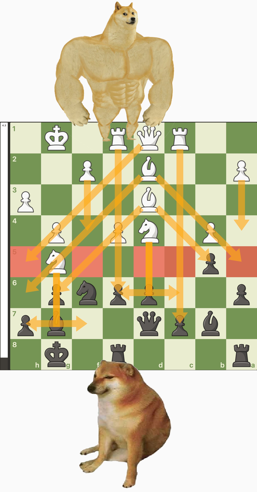

At the start of a game, **chess** offers you 20 possible moves-- 16 pawn pushes plus 4 pesky knight hops, which feels manageable.

But by the 4th turn, things escalate so quickly that you now have **85 billion** combinations to deal with. Like in Life.

And exactly as in Life, an overwhelming majority of these options are complete and utter **rubbish**. We are talking growing a mullet levels of rubbish. We are talking drinking milk after 11:00am, wearing Birkenstocks in October, breaking spaghetti in half, enjoying the works of Ryan Reynolds. Just the nadir of horrible decisions in a wasteland of **free will**.

So, as a self-proclaimed **Life Enthusiast** or at the very least *Life as a Service* customer, a couple of months ago I dove into the world of chess, eager to apply its hard-won lessons to my daily grind, which has occasionally seen its share of H4s.

Well, am I any good? Not at all!

This is why on November 3rd I travelled to Stockholm and squared against **Gotham Chess** and **Anna Cramling**, i.e. the biggest chess YouTuber and the cutest. I'm still talking about Gotham.

## But why?

This part comes at the end, for effect.

## The hosts

With nearly six million subscribers, **Gotham Chess** is one of the most recognizable figures in the chess community, and deservedly so. He is naturally a talented player, but his success relies primarily on being informative and entertaining. Gotham has an **improv-like** gift for delivering streams of consciousness packed with insightful game analysis and witty humor: a rarity in a market of heavily edited content.

The daughter of two Grand Masters, **Anna Cramling** started playing chess when she was 3. Her success as a content creator stems largely from a genuine enthusiasm for the game and her approachable, lighthearted style.

Anna talks with her hands as if she was Italian and at the same time employs this typically Swedish matter-of-fact way of saying things like:

<Dialogue>Now, this is a really bad move.</Dialogue>

That one can't help but find endearing.

## The show

Held at a venue by the King's Garden in central Stockholm, the event kicked off with a lively **Guess the Elo** segment, where the two hosts reviewed games submitted by the audience. I was relieved my contribution didn't make the cut, as it was a **blunder fest** that left me with 3 queens and still relied on the enemy king seppuku-ing himself.

The evening continued with a **Q&A**, blending heartwarming moments with a dose of **drama** commentary. It seems like no human endeavor is complete without a slice of conflict. I thought it was only true for Italians, but it's people.

As the first part of the event wrapped up, the hosts reflected on how remarkable it was to see such a **turnaround**. Not long ago, they noted, it would have been unthinkable to pack a full theater for a chess event-- i.e. a game that is admittedly as thrilling as watching a soccer match, a Formula 1 race, or grass growing.

So, for the turns having tabled this much and chess now enjoying widespread interest, we must be thankful for the **pandemic**.

*(Fine, they didn't say this. I threw it in to spice things up and keep you engaged.)*

<FigureLabel>Here I'm playing on a giant chessboard and not, as it might first seem, shrinking down to Sardinian height to play on a standard-sized one</FigureLabel>

## The game

During the second part of the event, I, along with 59 other VIP ticket holders, challenged the hosts to a game of **simul-chess**.

For the **n00bs**, this is a format where a single player (or in this case, two) hops from table to table, playing White on all of them and making a move on each one while holding all **60 games** in their mind.

Gotham and Anna gladly took on the task. However, to keep things moving at a reasonable pace, Anna’s parents — GM Pia Cramling and GM Juan Manuel Bellón López — stepped in to help.

So you must understand that I had **no chance**.

<FigureLabel>As his name length's suggests, Juan is originally from Spain</FigureLabel>

A game of chess is divided into **three phases**: the opening, the middlegame, and the endgame.

In the **opening**, you develop your pieces so they can work together while protecting your king, ideally by castling. This is not the time for improvisation; you want to stand on the shoulders of giants and follow well-studied opening strategies instead of, say, growing a mullet.

If you survive the list of known traps that can end you in a few moves, congratulations — you made it to the **middlegame**! Here, you start crafting attack plans while sabotaging your opponent’s. Pieces will be traded, blundered, heroically sacrificed, or stolen by cats.

When enough pieces have been cleared and no checkmate is in sight, you have reached the **endgame**. By now, the queen is probably gone, the king is strutting around being all misogynistic, and pawns are playing the game of thrones.

Let's see how it went for me...

## 1. Opening

Openings are so important that I spent the entire train ride to the capital deciding which one to use. In the end, I went for the **King's Indian Defense** because it's the only opening I know.

So, while my respectful opponents move their pieces in a **seemingly** random fashion, I develop my pieces based on theories I’ve absorbed from countless books. Fine, Instagram Reels.

However, I can't help but **blunder** my knight to Gotham because I'm the kind of person who, on their first day in prison, likes to be punched in the face by a random inmate to establish dominance or lack thereof.

Be it as it may, we end our opening in the following configuration...

Not too shabby, innit? The mayor is protected and I have plenty of **ideas** going forw-- just kidding, I'm in danger!

After the game, I fed the opening into **Stockfish** — the most powerful chess engine on the planet — and it laughed at me. I didn’t know it could do it!

Turns out that White had an **overwhelming** range of choices ahead, whereas Black basically brexited...

I'm King Harren the Black, barricading inside the impregnable castle which carries my name and feeling all **hygge and shizz**, while from the sky I'm about to be barbequed by **Aegon Targaryen** The Conqueror. First of his name. King of the Andals, the Rhoynar, and the First Men. Lord of the Seven Kingdoms and Protector of the Realm.

*(It bothers me that I didn't need to look it up.)*

<FigureLabel>I took this selfie right after he got my knight. Stockholm Syndrome</FigureLabel>

## 2. Middlegame

That said, I didn't travel first class and spent the night at a five-star hotel for **nothing**. I am determined to lose slowly and painfully, dragging my **carcass** with dignity.

I go full **desert storm**, protecting my pieces and preventing White's rude attempts at forking attacks. In the entirety of the middlegame, I make one single mistake, which I comment to my opponent with a loud:

<Dialogue>BRO!</Dialogue>

You will ask, was this to Gotham? I wish! But it was to Pia. 🙈

Around me, players are falling like **autumn leaves**. But a couple of them win their game, plus a few others manage to force a draw. They all get shouted out by the speaker and a **thunderous applause** celebrates their accomplishment.

<Dialogue>You are not giving up,<GlyphRight/> Gotham tells me around the 20th move. <GlyphLeft/>Good!</Dialogue>

I want to reply that I can do this all day, but have a train to catch, so I could not, in fact, have done this all day.

At some point, Pia even whispers **Fy fan!**, which is Swedish for *I'm really enjoying this game!*

In all this, my Apple Watch keeps asking me:

<Dialogue>Hey, are we ok?</Dialogue>

Apparently, my **heart** is pumping as if I'm running from the police...

This is what happens when you push yourself out of your **comfort zone** and do something so inadequately outrageous.

Or maybe this is simply due to Anna asking me if I'm **Finnish**.

Speaking of, she declares <GlyphLeft/>Let's spice things up<GlyphRight/> and triggers a flurry of trades that catapults us into the endgame.

## 3. Endgame

This is the **sorry ass** state of the board...

Can you see how my King is all but **surrounded** while their King completely lacks any form of surrounding?

**Stockfish** says it's mate in 2 for White. Also, I need to pee real bad and my train is tapping on my shoulders. I'm about to figuratively throw in the towel when it **appears** to me. The move I have been waiting for. A final (fine, first) attack to go out in style and bring the house down with me!

Do you see it?

Exactly. Queen D1 **check**!

With the pawn sniping G2, this leaves the King only one square to escape to. Stockfish is now 50-50 on us. **Hypocrite**. It loved White five minutes ago!

My strategy is clear. This is what I’ve strived for all those years of playing chess (fine, weeks). I become **unstuck** in time. Nothing is of substance anymore. The train. The pee. My entire life flashes in front of my eyes and I can't help but notice a mullet from ages 14 to 16.

After the King moves, I go Queen F1, then Queen G2 **check mate**!!!

However, I do not have two **consecutive** moves, do I? I didn't consider this.

Anna hops in, and after placing the King out of check, says:

<Dialogue>I think you have one move left.</Dialogue>

Classic Anna!

Can you figure out White's next move?

It is of course Queen F3, which removes my mating aspirations and enables a descent **south** that will inevitably win the game.

I pick up my King, bring him to the backyard, and shoot him in the face with a shotgun, as was customary back then.

<TextBox title={"Little known fact"}>
    
    According to legend, King <strong>Adolf Frederick</strong> of Sweden died in 1770 after eating a meal featuring 14 semlor among other dishes.
    
    
    
    Given my recent <a href={"/diabetes"}>diagnosis</a>, this is exactly how I want to go.
    
</TextBox>

With the King lying in a puddle of blood, there is only time to say thank you, shake hands, take a blurry selfie...

...then I'm off. I played against two YouTubers and two Grand Masters and survived until move 32. What a day.

## Ok, but why?

I belong to the silent majority of people who don't have a **thing**.

Do you know what I mean? Anna and Gotham's thing is chess, obviously. Picasso's thing was painting and prostitutes. Sardinians' thing is being Sardinians.

<FigureLabel>You're goddamn right</FigureLabel>

If you are a **surfer**, then surfing has to be your thing. You can't half-ass surfing. It's your identity. That's why we say you *are* a surfer, and not that you surf on weekends. You are probably thinking about waves right now. You say **dude** a lot and surround yourself with other like-minded surfers because, frankly, everyone else finds you unbearable.

Painting **Warhammer 40K** miniatures can also be a thing. Now, is it a good thing? Opinions might vary! But it's beside the point.

Having a thing matters because the act of doing it feels **meaningful**. It’s not something you have to force. It’s effortless because it defines you.

For me, work occupies 80% of my waking hours and some of the sleeping ones (I have the git history to prove it). I love it and it is in many ways a thing. But I also hold the remaining 20% of life’s real estate in high regard. So **striving** to have a thing there feels very important.

## My thing

I have of course tried surfing after watching **Point Break**. I've caught a few waves, nearly smashed my teeth, got a carpenter suntan, and said dude more times than I care to admit.

But I realized surfing was not my thing when my **sensei** told me:

<Dialogue>You see, Gianluca. A wave breaking is so powerful that the water <strong>molecules</strong> smash and split and...</Dialogue>

<Dialogue>Wait, wait, wait. Are you saying each wave could potentially trigger an uncontrolled chain <strong>atomic</strong> reaction?</Dialogue>

<Dialogue>Uh... yeah, dude!</Dialogue>

That's why I quit surfing. Too dangerous.

<FigureLabel>I put everyone at risk</FigureLabel>

For a while, I thought **writing** was my thing. But here’s the thing (sorry): I’ve been working on a post about the **meaning of life** since last February. In my head, it’s all there: groundbreaking revelations, perfectly timed jokes, pacing that feels like clockwork, callbacks tying it all together. That was the easy part.

But actually sitting down to type it out? Shuffling commas, removing repetitions, making it sound like music? That’s horrible! It’s so hard that I rather go and re-watch **In Bruges** instead.

<FigureLabel>Remember when painting was my thing? It lasted until <strong>Midjourney</strong> made it a waste of time</FigureLabel>

So I am a **thingless** person. But how does one even get a thing?

## Mimetic desire

French philosopher **René Girard** would argue you don't have to do anything. We have very little agency. Our desires are mere imitations of the desires of others. We are desire Xeroxes.

For instance, I didn't just randomly decide to surf, did I? I watched a movie and concluded **robbing banks** was too much hassle. That's also why I'm currently planning a trip to Bruges. It's in Belgium.

Do you think Pia and Juan told her 3-year-old daughter:

<Dialogue>Anna, no. You can't be a doctor. Du måste spela chess!</Dialogue>

<FigureLabel>I could be treating hemorrhoids right now</FigureLabel>

Of course not. Anna absorbed it all. The dinner table debates about openings, and the late-night game analyses before she was tucked in. Anna didn’t need to be told; she just **soaked** it in.

That’s why the sons and daughters of actors tend to be actors (plus, they’re **hot**). That’s why the sons and daughters of Sardinians tend to be Sardinians.

And it’s not only family influence; not anymore. **Social media** is a giant mimetic desire machine. We are fed a constant stream of strangers baking sourdough, running marathons, or speaking High Valyrian, and suddenly think <GlyphLeft/>I should be doing it too!<GlyphRight/>

And therein lies the problem.

## The pitfalls of mimetic desire

While **scrolling**, you stumble upon an incredible guitar solo…

<YouTube source={"M4lsB-B1O7U"} />

There you go. Now all you want is to learn how to play guitar. Damn you, **Girard**! So you head to the music shop and spend money on guitars, tuners, amplifiers, and sound suppressants. Then, you book classes and make space in your life.

However, more often than not, **nothing** will come of it. The mimetic desire you expressed is wrong. You told yourself you want to learn playing guitar, but what you really meant is:

<Pony>I want to have learned playing guitar.</Pony>

You are picturing yourself on the beach at night by the campfire, pulling out a six strings, riffing *Wish you were here*, and **melting hearts**. What you are not factoring in is the grind to get there: the hours of repetitive scales, the blisters on your fingertips, and the soul-crushing realization your chords sound like a **horny manatee**.

<small>
(Apparently, horny manatee violates Midjourney's terms of service.)
</small>

Suffice to say, this has **occasionally** happened to me, which is why I don't fall into these traps anymore. A few months back, I deleted a piano from the shopping cart because, I concluded, I was not willing to alter my schedule to fit in an hour a day to practice.

<FigureLabel>Plus, the logistics of bringing a long-tail piano to the beach at night are just a nightmare</FigureLabel>

## What then?

First of all, I'm completely okay with **not having** a thing. I don't want to say **dude**, I don't care for blisters, and I'm not looking into breaking a bone at 48, thank you. It's fine. I'm fine.

<ResponsiveEmbed ratio={"16:11"} src={"https://giphy.com/embed/zHd8x7Pik0Ftm"}/>

If the **Universe** has decided I’m not meant to specialize, then I’ll embrace being a jack-of-all-trades. But as a non-thing-haver, new endeavors don’t feel effortless, which means my **conviction** risks crumbling at the first gust of wind. So I need to **cheat** my way in, and the best strategy for it is to mingle with deeply tuned-in people.

Cue the chess event.

Mind you, this is not a **fake it till you make it** kind of approach, as we have [already established](/impostor-syndrome) it is a toxic trait.

It's not your expertise I'm drawn to. It's your **enthusiasm**.

I want to surround myself with people who can’t help but love what they do. I want to hear their **inside jokes**, feel the excitement when their hero shows up, and catch their frustrations while marveling at how, despite the **pain points**, they just won't stop doing the thing.

That's what I got from the event. Shaking hands with Gotham Chess, saying if I don't improve, this means his book is **broken** and I will need a replacement. Hearing a woman in a wheelchair share how she met Pia Cramling **44 years** ago. Admiring a brilliant Spanish exchange student who went from beginner to 1900 Elo in just months. And this girl who, on a bad day, had her spirits lifted by Anna’s shout-out during a stream.

I’ll latch onto these emotions, **siphon** your life experiences, and mimetic-desire the hell out of this energy!

<FigureLabel>We wants it!</FigureLabel>

## Well, did it work?

TL;DR, yes.

Since the event, I have improved my chess skills significantly. Sometimes, I play like a **1600 chad** with an accuracy in the nineties.

<FigureLabel>Other times, I play like a <strong>400 lolcow</strong>. We don’t talk about those times</FigureLabel>

I've been reading **books** on the subject, which is always a good idea. Turns out, there is so much knowledge you can extract from these things.

My **Notion** is now sizzling with notes on chess.

I have an **arch-nemesis**! You can’t say you are deep into a discipline until you have made an arch-nemesis. To weaken him, I dm **toxic positivity** like:

<Dialogue>Thank you for playing with me. I have been learning a lot! 🥰</Dialogue>

To which he replies with a 👍. I hate him so much.

<FigureLabel>Effing Don Jules</FigureLabel>

And while I’m still losing an important majority of the games, I feel like I'm developing the right **patterns**. I can more easily see potential check-mates and plan a few turns instead of **panic-moving**.

In fact, these improved **instincts** are making me go back to the game I played against Gotham, Anna, Pia, and Juan.

Something's bugging me.

## What’s bugging me

Remember how, in the endgame, I was **surrounded** and Stockfish predicted mate in 2? Then I threw in a **hail-mary** check and Stockfish flipped to 50-50 odds.

Well, how can it be?

My move was inconsequential. A **wet fart**. Is Stockfish stupid? And why a perfect 50-50 and not, say, 60-40, or 51-49? Why did it go even odds if not for--

<ResponsiveEmbed ratio={"16:9"} src={"https://gifer.com/embed/PsX1"}/>

Computer, show me move 31.

Okay, so the King retreats to H2 and we are 50-50. My following move Queen to F1 loses the game, so let's move something else. Like, maybe Queen to D6 check?

My Queen is safe by pure miracle. The King is forced back to the **first rank** because it's either that or his wife jumping in front of the bullet, which would be a guaranteed defeat for White, so it's a large bucket of nope.

So I go Queen D1 again check, then Queen D6 check, then D1, D6, D1... motherf-

<Pony>I COULD HAVE FORCED A DRAW! 🙈</Pony>

  <iframe 
    src="https://gifer.com/embed/PsX1" 
    frameBorder="0" 
    allowFullScreen
    style={{
      width: '100%',
      height: '400px',
      border: 'none'
    }}
  ></iframe>

