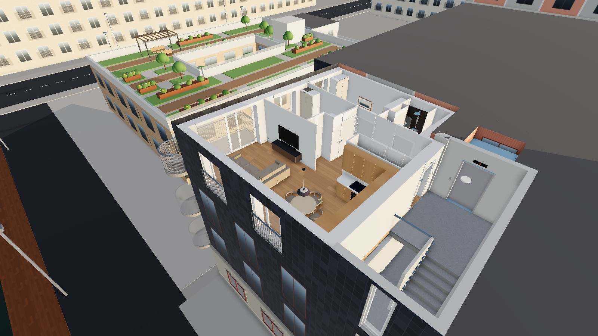
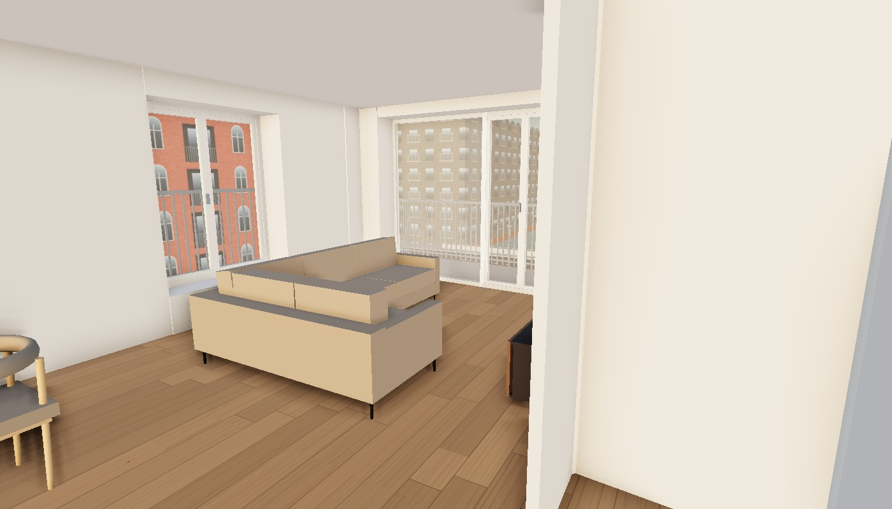
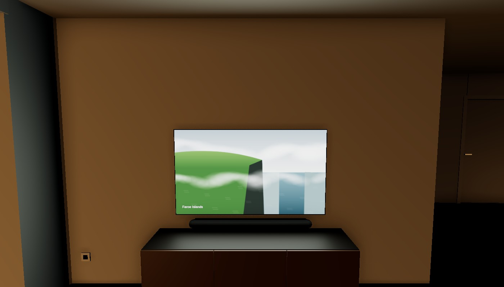
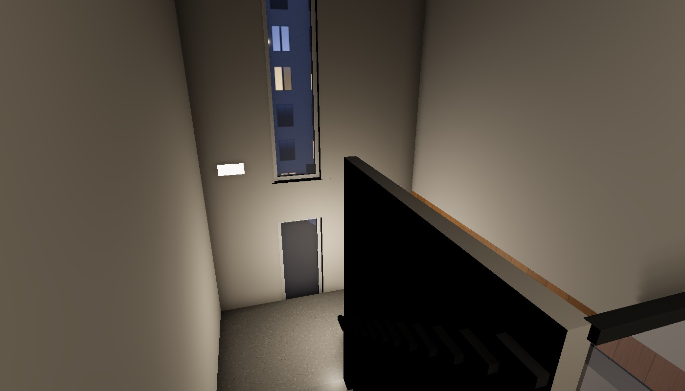
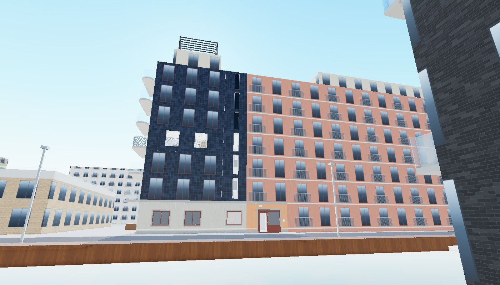
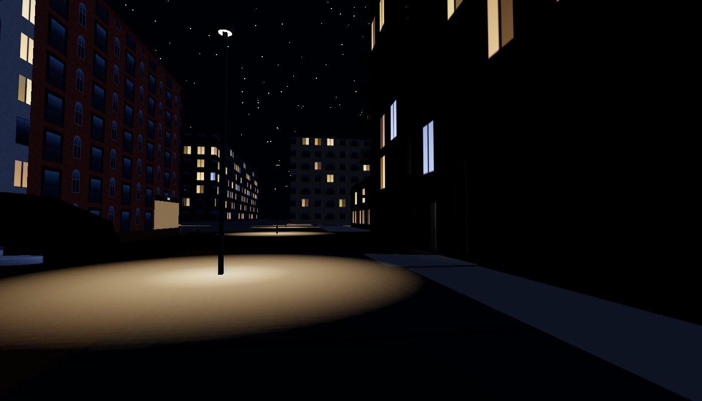

{/*
  DRAFT — hidden: true keeps it out of the homepage, archive, feed and sitemap listings,
  but it is reachable at /home-styling-rabbit-hole for previewing. Flip to false to publish
  (and update the date).

  Section notes are MDX comments like this one; they don't render.
*/}

## How it started

{/* The flat in Sluseholmen, a floor plan PDF, and one innocent question about a sofa. */}

_To be written._

<FigureLabel>The flat from above, with the roof politely removed.</FigureLabel>

## From floor plan to Blender

{/* Plan → walls and openings → Blender model → Cycles renders. The first renders, the dollhouse views. */}

_To be written._

## Then it became a website

{/* three.js walkthrough at /apartment; walking, doors that open, the fridge (with beer), the tape measure, sizes, sockets. */}

_To be written._

<LinkButton to={"/apartment"} onHover={"🚪🚶‍♂️"}>Walk around the flat</LinkButton>

<FigureLabel>The living room, with one of the many sofas on trial.</FigureLabel>

## The furniture showroom phase

{/* Real Danish products with real sizes, prices and links: sofas, Besalu + Kasami, PAX/FLISBERGET, The Frame, the PH 5, Arezzo sofa bed. Moving things 5 cm at a time and checking the gaps. */}

_To be written._

## Every light is a Philips Hue

{/* Wall switches, dimming and colour, the PH 5 cone, TV strips, kitchen spots, the fridge light, solar fairy lights on the balcony. */}

_To be written._

<FigureLabel>Yes, the TV turns on. It plays an aerial screensaver. No, nobody asked.</FigureLabel>

## Leaving the flat

{/* The aerial photo, the canal, the SATS building and its pier, the boats, the bridge, the footbridge at the harbour mouth. Entrance no. 9, the stairs, the lift, strolling on the quay. */}

_To be written._

<FigureLabel>Motion-sensor lights in the stairwell, because of course.</FigureLabel>

<FigureLabel>Our building from across the canal. The pink starts where entrance no. 9 is.</FigureLabel>

## Day, night, and the neighbours going to bed

{/* Time-of-day slider, the moon, street lamps, lit windows that go dark after midnight, a bluer Mediterranean sky that Copenhagen does not deserve. */}

_To be written._

<FigureLabel>22:30 on Grethe Ingmanns Vej.</FigureLabel>

## What I learned (about AI, and about myself)

{/* Where it shined, where it needed correcting (the lamp shape, the entrance, the fake windows), the scope creep, and the actual furniture decisions. */}

_To be written._

<TextBox title={"How it was built"}>
_To be written: Claude (Cowork), Blender via Python, three.js, a single self-contained HTML page served by this blog._
</TextBox>
